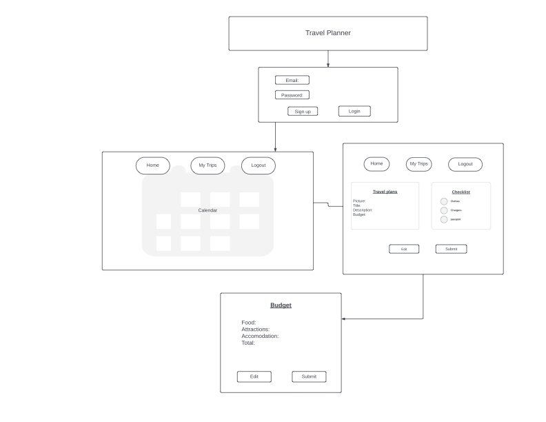

# Travel Advisor - React Frontend

For our SEI Project #3, we'll be building an app to assist in planning trips. The main features will help users be more prepared and organized with packing and budgeting. As stretch golas, we've got ideas to integrate Google Maps to find places to stay and eat, and ChatGPT to make packing & budgeting suggestions.

### User Stories

- _As a user,_ I want to be able to login.
  - _As a user_, I want to be able to edit my name and info.
- _As a user_, I want to see a calendar of my trips.
- _As a user_, I want to start planning a new trip.
  - _As a user_, I want to edit the details of my trip.
  - _As a user_, I want to delete my trip, in case it gets cancelled.
- _As a user_, I want to have an editable checklist, to help plan what to pack.
- _As a user_, I want to plan out the trip's budget.

### Pages _(React Router)_

- Login / Home Screen
- Calendar / Dashboard
- Trip show page
- Trip's Budget

### Technologies Used

- CSS
- JavaScript
- React / React Router
- _Stretch goals:_
  - GPT / OpenAI _(for helping with packing lists & budgeting)_
  - Google Maps _(for finding lodging and dining options)_
  - Skeleton / Bootstrap

### User Interface Wireframe

### Related Links

- [Backend Repo](https://github.com/jliakim23/project3-backend)
- [Project Trello](https://trello.com/b/HFDgCYOP/trip-advisor)
